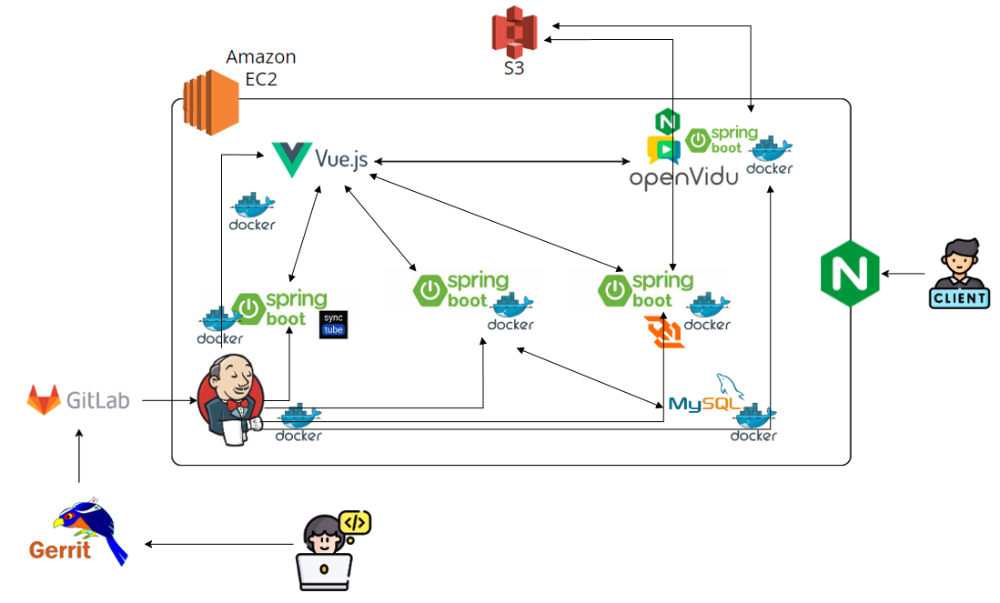
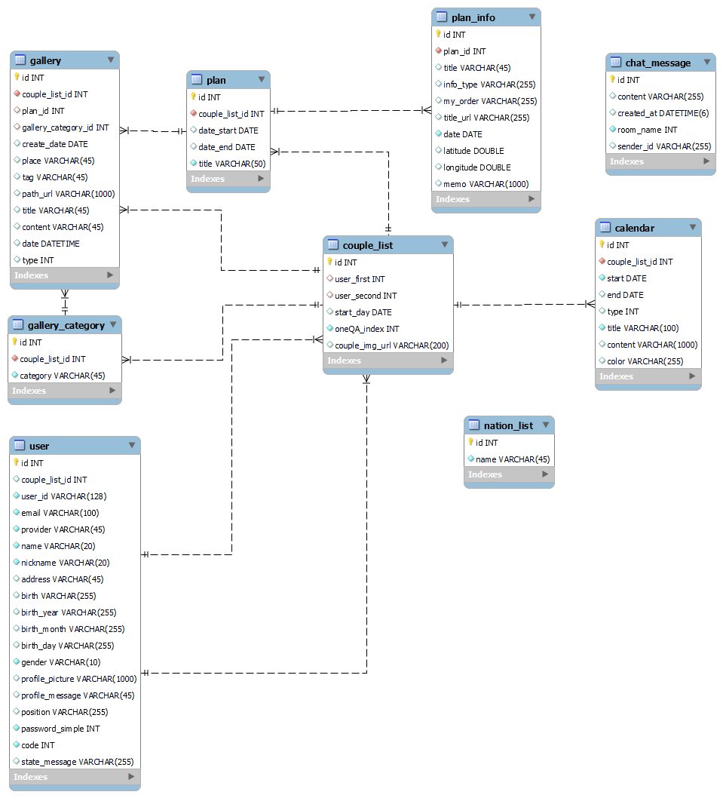

# LongD, 세상의 모든 장거리 커플들을 위한..
](MD/image.png)
## 팀원 소개
### Front-End
- 이정민
- 전근렬
- 조현제
### Back-End
- 손동천
- 김익환
### Infra
- 정경리

## 개발 환경
- ### 협업 툴

     
    
    
    

- ### Front-End

    
    
      

- ### Back-end

    
    
    
    
 - ### Infra

    
    
    
    
    
    
    
## 버전
| 프로그램/언어 | 버전 |
|---|:---:|
|JAVA|17|
|Spring boot|3.2.2|
|Vue|3.3.11|
|MySQL|8.0.33|
|node.js|20.10.0|
|Docker|4.26.1|
|Jenkins|2.443|
|Ngingx|nginx/1.18.0 (Ubuntu)|

## 시스템 아키텍처

## ERD

## API 명세서

## 와이어프레임

## 포팅 매뉴얼

## 와이어프레임
https://intriguing-aluminum-a33.notion.site/LongD-cd2d925dccfa4db398f69bb1311ac508
## 주요 기능
1. 캘린더
    - 일정 및 세부 내용 등록
    - hover를 통한 내용 확인

2. 여행 계획
    - 장소 찜 목록
    - 여행 계획 정하기
    - 여행중 찍은 사진 업로드시 일정 세부사항에 자동 추가

3. 화상통화
    - 통화가 연결되기 전 영상이 있다면 영상 재생
    - 통화중 녹화 기능 제공

4. 영상 같이 보기
    - 커플간 함께 하나의 영상을 같이 볼수있는 환경 제공
    - 하나의 영상에 대해 함께 제어할 수 있는 기능 제공

## 서비스 화면

### 1. 소셜 로그인 및 커플 연결
#### 소셜 로그인

#### 커플 연결

### 2. 화면 잠금

### 3. 메인 화면 및 프로필
#### 메인 화면 변경

#### 프로필 수정

#### 상대방 프로필 확인

### 4. 갤러리

#### 폴더 및 사진 추가

#### 사진 조회 및 삭제

### 5. 캘린더
#### 캘린더 일정 추가

#### 캘린더 일정 수정 및 이동

#### 캘린더 일정 삭제

### 6. 화상 통화
#### 통화 대기 영상

#### 통화

#### pip모드

### 7. 영상 같이 보기

### 8. 여행 계획 짜기
#### 여행 일정 짜기

#### 여행 일정 상세보기

#### 여행 일정 목록 및 삭제

